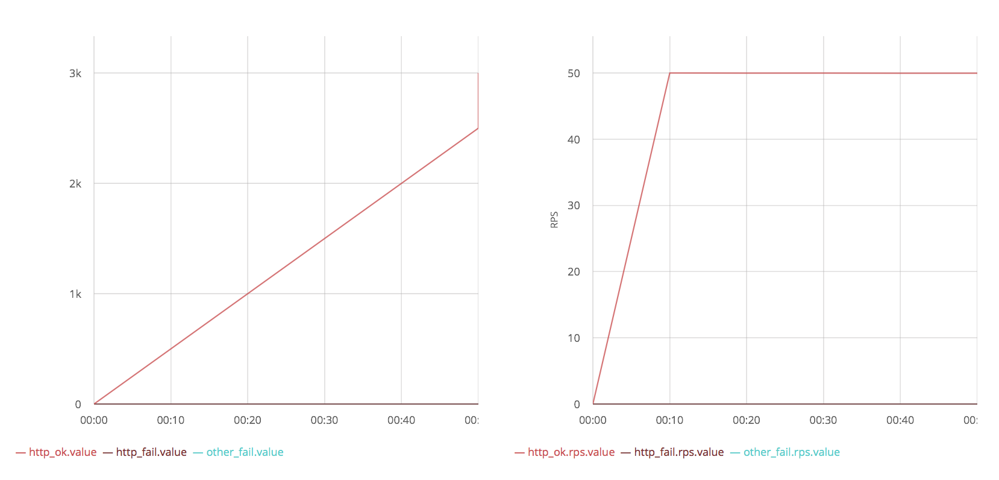

# Welcome to MZBench [](https://travis-ci.org/machinezone/mzbench) [](https://gitter.im/machinezone/mzbench?utm_source=badge&utm_medium=badge&utm_campaign=pr-badge&utm_content=badge) [](http://issuestats.com/github/machinezone/mzbench) [](http://issuestats.com/github/machinezone/mzbench)

***Expressive, scalable load testing tool***

---


MZBench helps software testers and developers test their products under huge load. By testing your product with MZBench before going to production, you reduce the risk of outages under real life highload. 

MZBench runs test scenarios on many machines simultaneous, maintaining millions of connections, which make it suitable even for large scale products.

MZBench is:

 - **Cloud-aware:** MZBench allocates nodes directly from Amazon EC2. 
 - **Scalable:** tested with 100 nodes and millions of connections.
 - **Extendable:** write your own [cloud plugins](doc/cloud_plugins.md#how-to-write-a-cloud-plugin) and [workers](doc/workers.md#how-to-write-a-worker). 
 - **Open-source:** MZBench is released under the [BSD license](https://github.com/machinezone/mzbench/blob/master/LICENSE).

[Read the docs →](https://machinezone.github.io/mzbench)


## Installation

To use MZBench, you'll need:

 - Erlang R17
 - C++ compiler
 - Python 2.6 or 2.7 with pip

Download MZBench from GitHub and install Python requirements:

```bash
$ git clone https://github.com/machinezone/mzbench
$ sudo pip install -r mzbench/requirements.txt 
```

## Quickstart

Start the MZBench server on localhost:

```bash
$ cd mzbench
$ ./bin/mzbench start_server
Executing make -C /path/to//mzbench/bin/../server generate
Executing /path/to//mzbench/bin/../server/_build/default/rel/mzbench_api/bin/mzbench_api start
```

When the server is running, launch an example benchmark:

```bash
$ ./bin/mzbench run examples/ramp.erl
{
    "status": "pending", 
    "id": 6
}
status: running                       00:09
```

Go to [localhost:4800](http://localhost:4800) and see the benchmark live status:




## Read Next

 - [How to write scenarios →](doc/scenarios/spec.md)
 - [How to control MZBench from command line →](doc/cli.md)
 - [How to deploy MZBench →](doc/deployment.md)
 - [How to write your own worker →](doc/workers.md#how-to-write-a-worker)

