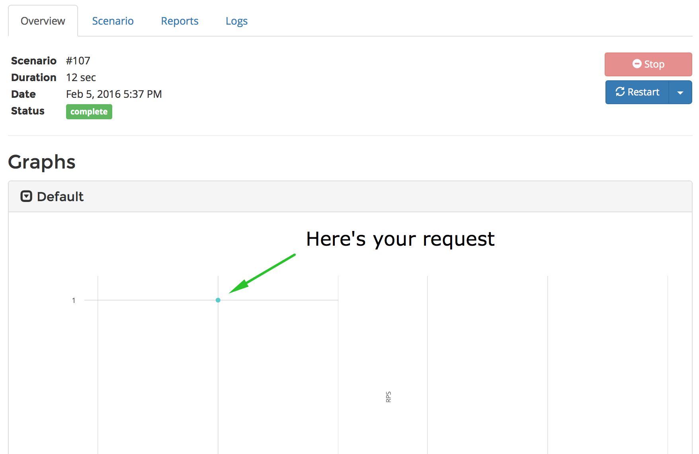
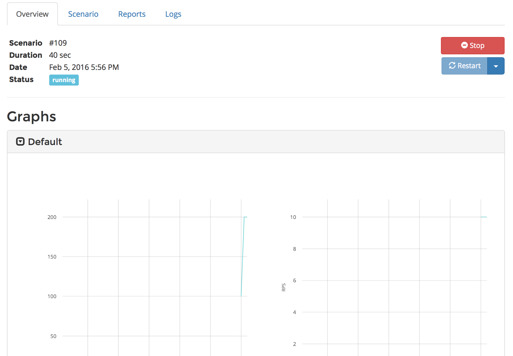

# How to Write a Scenario

**Scenarios** describe how you want MZBench to behave during the benchmark. If you're testing an online store, your scenario will probably include opening a product page and adding the product to cart. For a search service, the scenario may be searching for a random word. You get the idea.

Here's how you write a scenario to load-test a locally running web app.

1.  Create a file called *myscenario.bdl* with this content:

        pool(size = 1,
             worker_type = http_worker):
            set_host("localhost")
            set_port(8080)
            get("/")

    Scenarios are written in [special language](spec.md) similar to Python in some aspects. Here's what this scenatio means, step by step:

        pool(size = 1,
             worker_type = http_worker):

    Here we define a [pool](spec.md#pools) of workers, namely one worker of type `http_worker`. Workers of this type can send GET and POST HTTP requests, which is exactly what we need.

            set_host("localhost")
            set_port(8080)
            get("/")

    Here we define the actions that each worker in the pool must perform: set the target host and port and send a single GET request to the "/" endpoint, i.e. to *http://localhost:8080/*.

2.  Launch the MZBench server and start your scenario:

        $ ./bin/mzbench start_server
        Executing make -C /path/to//mzbench/bin/../server generate
        .........
        Waiting for server application start
        Webserver is started at http://127.0.0.1:4800
        Active config file is ~/.config/mzbench/server.config
        ok
        
        $ ./bin/mzbench start /path/to/myscenario.bdl
        {
            "status": "pending", 
            "id": 107
        }
        
3.  Go to [localhost:4800](http://localhost:4800) and see your benchmark run and complete:

    

    Great, it works! But one request isn't going to load your web app too much, is it? Let's extend our scenario to generate some proper load.
    
4.  Modify *myscenario.bdl* so that it looks like this:

        pool(size = 1,
             worker_type = http_worker):
                set_host("localhost")
                set_port(8080)
                loop(time = 1 min,
                     rate = 10 rps):
                        get("/")
        
    We've replaced a single GET request with a [loop](spec.md#loops) that sends 10 requests per second for 1 minute.
    
5.  Start the modified scenario:

        $ ./bin/mzbench start /path/to/myscenario.bdl
        {
            "status": "pending", 
            "id": 109
        }
        
    Go to [localhost:4800](http://localhost:4800) to see a graph updated in real time as your benchmark is running:
    
    

## Read Next

-   [Read the full scenario language spec →](spec.md)
-   [Learn about workers and how to write them →](../workers.md)
-   [Learn how to deploy MZBench →](../deployment.md)